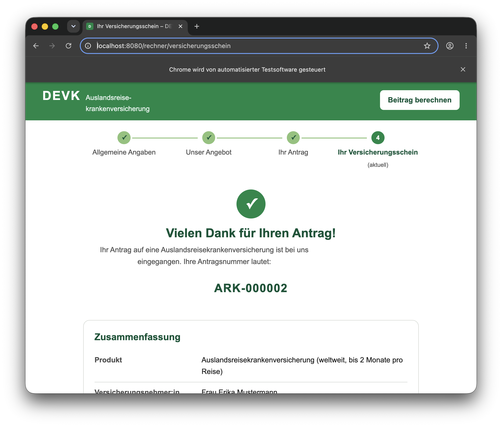
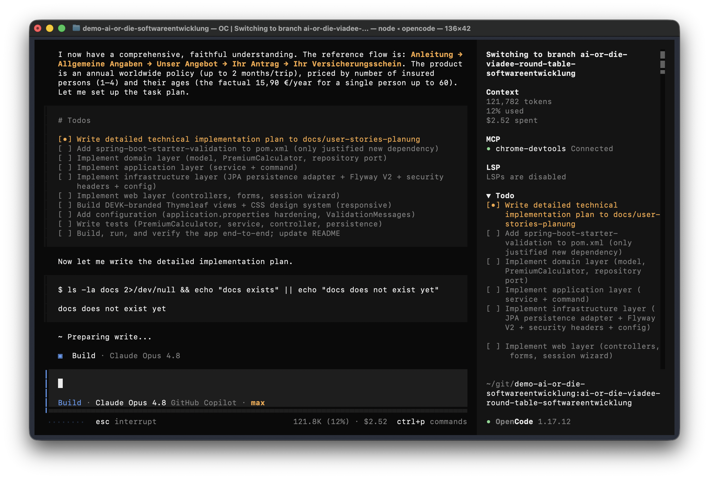
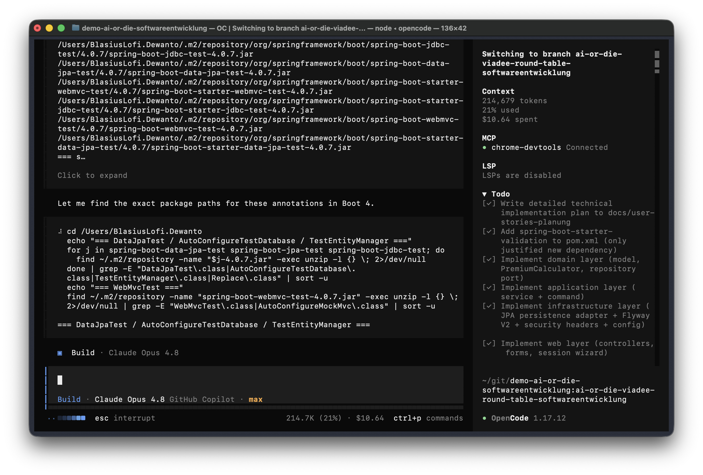
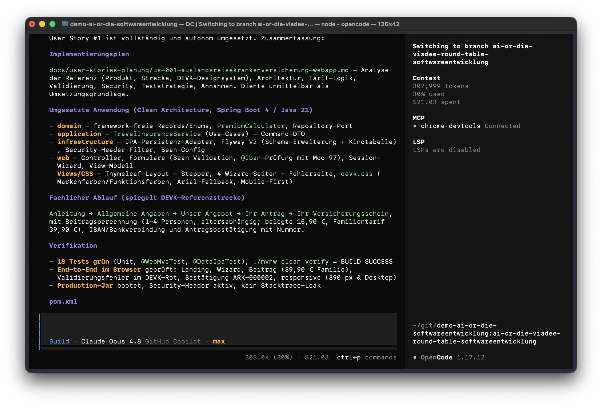

# TAA-Webapp – Ergebnisdokumentation der Entwicklungssession

Zusammenfassung der autonomen Umsetzung von User Story
[#1](https://github.com/lofidewanto/demo-ai-or-die-softwareentwicklung/issues/1)
„Erstellung einer Webapp für die Auslandsreiseversicherung" (DEVK ARK / TAA).

> Reine Demonstrationsanwendung im DEVK-Design – kein echtes DEVK-Angebot, kein
> Vertragsabschluss, kein Beitragseinzug.

---

## 1. Session Summary

### Was wurde erreicht
Aus einem reinen Spring-Boot-Scaffold wurde eine vollständig lauffähige, getestete
und DEVK-gebrandete Webanwendung für die **Auslandsreisekrankenversicherung**
entwickelt – inklusive detailliertem Implementierungsplan
(`docs/user-stories-planung/us-001-auslandsreisekrankenversicherung-webapp.md`).
Die Anwendung informiert über das Produkt und führt Nutzer:innen durch einen
digitalen Angebots- und Antragsprozess, der die DEVK-Referenzstrecke nachbildet.

### Finale Architektur (Clean Architecture / Ports & Adapters)

```
web            → Controller, Formulare (Bean Validation), Session-Wizard, View-Modelle, Thymeleaf
  │  nutzt
application    → TravelInsuranceService (Use-Cases), SubmitApplicationCommand
  │  nutzt
domain         → Records/Enums, PremiumCalculator, Repository-Port     (framework-frei)
  ▲  implementiert Port
infrastructure → JPA-Adapter, Flyway, Security-Header-Filter, Bean-Konfiguration
```

Die Abhängigkeitsrichtung zeigt stets nach innen. Die Domain kennt weder Spring
noch JPA und ist damit rein und unit-testbar.

### Prozess (spiegelt die DEVK-Referenzstrecke)

`Anleitung (Landing) → Allgemeine Angaben → Unser Angebot → Ihr Antrag → Ihr Versicherungsschein`

POST-Redirect-GET mit `@SessionScope`-Wizard, Fortschritts-Stepper und
Guards für die Schrittreihenfolge.

### Wesentliche Implementierungsentscheidungen

| Entscheidung | Begründung |
|---|---|
| Nur **eine** neue Dependency: `spring-boot-starter-validation` | Bean Validation fehlte im Classpath, für AK 5/6 zwingend; Version BOM-verwaltet → konfliktfrei |
| **Java 21 Records** für Domänen-Wertobjekte | Unveränderlichkeit, weniger Boilerplate |
| **Präsentations-View-Modell** (`ConfirmationView`) statt Domain-Record in der View | SpEL/Thymeleaf löst Record-Accessoren nicht als Properties auf (siehe Findings) |
| **Kein Spring Security** | Öffentlicher, nicht authentifizierter Demonstrator; volle Security wäre Overengineering (AK 8). Stattdessen Security-Header, Härtung, Output-Escaping. Bewusst dokumentiert. |
| **Flyway V2** statt Änderung an V1 | Flyway-Immutabilität; V2 ergänzt Spalten + normalisierte Kindtabelle `travel_insured_person` |
| Beitrag: nur **15,90 €** faktisch belegt, Rest dokumentierte Demo-Annahmen | Ehrliche Kennzeichnung, testbare Domänenlogik |
| DEVK-Fallback-Schrift **Arial** | Marken-Fonts (Ahkio/Univers Next) lizenzpflichtig; Markenportal schreibt Arial für Vertrags-/Produktkontexte vor → self-contained |

### Wichtige fertiggestellte Features
- Produkt-Landingpage (Leistungen, „So funktioniert's", CTA)
- Mehrstufiger Angebotsrechner mit Stepper und Session-State
- Beitragsberechnung 1–4 Personen, altersabhängig (`PremiumCalculator`)
- Serverseitige Validierung inkl. **IBAN-Prüfung (ISO 7064 Mod-97)** und
  feldgenauer, konditionaler Pflichtfeldprüfung; deutschsprachige Fehlermeldungen
- DEVK-Designsystem (Marken- und Funktionsfarben), responsiv (Mobile-First)
- Persistenz des Antrags (H2 + Flyway) inkl. Kindtabelle, Antragsnummer
- Baseline-Security: Security-Header, gehärtete Session-Cookies (HttpOnly,
  SameSite=Lax, Cookie-only-Tracking), DEVK-Fehlerseite ohne Stacktrace-Leak
- **18 automatisierte Tests** (Unit, `@WebMvcTest`, `@DataJpaTest`) – alle grün

### Offene TODOs (für echten Produktivbetrieb, außerhalb des Demo-Umfangs)
- Spring Security inkl. CSRF-Schutz
- Echte Tarifierung + Anbindung an Policierungs-/Zahlungs-Backend
- Persistente DB statt In-Memory-H2; Session-Externalisierung für horizontale Skalierung
- End-to-End-/Integrationstest über die komplette Submit-Strecke
- Barrierefreiheits-Audit (WCAG) und ggf. Mehrsprachigkeit

### Lessons Learned (Kurzform)
- Spring Boot 4 hat Starter- und Test-Slice-Pakete **modularisiert** – Namen/Pakete
  weichen von Boot 3 ab und müssen verifiziert werden.
- **Records + Thymeleaf/SpEL** vertragen sich nicht ohne Weiteres → dedizierte
  View-Modelle in der Präsentationsschicht sind die saubere Lösung.
- Reverse-Engineering der Referenzstrecke per `curl` lieferte exakte Feldnamen und
  Security-Header, die 1:1 übernommen werden konnten.

---

## 2. Session Statistics

| Kennzahl | Wert |
|---|---|
| Start | 20:20 |
| Ende | 21:24 |
| **Dauer** | **1 h 4 min (64 Minuten)** |
| Start-Token | 41.728 |
| Stop-Token | 43.567 |
| Token-Delta (Kontextzähler, **nicht** abgerechnet) | 1.839 |
| Kontext am Session-Ende (OpenCode) | 302.999 Token (30 % des Fensters) |
| **Reale Session-Kosten (OpenCode-gemessen)** | **≈ 21,03 USD (≈ 2.103 AIC)** |
| Modell / Zugang / Plan | Claude Opus 4.8 · GitHub Copilot · „max" |
| Automatisierte Tests | 18 (alle grün) |
| Neue Produktions-Dependencies | 1 (`spring-boot-starter-validation`) |
| Geänderte `pom.xml`-Versionen | 0 |

### Token-Kosten (GitHub Copilot AI Credits – recherchiert)

> **Quellen (GitHub Docs, recherchiert):**
> [Usage-based billing for individuals](https://docs.github.com/en/copilot/concepts/billing/usage-based-billing-for-individuals),
> [Models and pricing for GitHub Copilot](https://docs.github.com/en/copilot/reference/copilot-billing/models-and-pricing).
> Zum **1. Juni 2026** wurde die Abrechnung von **Premium Requests (PRUs)** auf
> **GitHub AI Credits (AICs)** umgestellt. Es gilt: **1 AIC = 0,01 USD**.
> Abgerechnet wird pro **Token** (Input/Output/Cached) je Modell; die Summe wird in
> AICs umgerechnet.

**A) Abrechnungsmodell (AICs, seit 1. Juni 2026)**

| Position | Wert |
|---|---|
| Abrechnungseinheit | AI Credit (AIC), 1 AIC = 0,01 USD |
| Basis | Token × Modellpreis → AICs |
| Enthaltenes Kontingent | Pro 1.500 AIC/Mon. (10 USD), Pro+ 7.000 (39 USD), Max 20.000 (100 USD) |
| Rabatt bei Auto-Modell-Auswahl | 10 % auf Modellkosten |
| Modell | `github-copilot/claude-opus-4.8` (Claude Opus 4.8, Kategorie „Powerful") |

**Preise Claude Opus 4.8** (pro 1 Mio. Token):

| Tokenart | USD/1M | AIC/1M |
|---|---:|---:|
| Input | 5,00 | 500 |
| Cached input | 0,50 | 50 |
| Cache write | 6,25 | 625 |
| Output | 25,00 | 2.500 |

**Illustrative Session-Kosten** (auf Basis der 1.839 Token, angenommener 80/20-Split Input/Output, ohne Cache):

| Position | Menge | AICs | USD |
|---|---:|---:|---:|
| Input | ~1.471 Token | ~0,74 | ~0,0074 |
| Output | ~368 Token | ~0,92 | ~0,0092 |
| **Summe** | 1.839 Token | **~1,7 AIC** | **~0,017** |
| … mit 10 % Auto-Modell-Rabatt | | ~1,5 AIC | ~0,015 |

> **Vorbehalt.** „1.839" ist eine Kontextzähler-Differenz, **nicht** das real
> abgerechnete Token-Volumen; eine agentische Coding-Session verbraucht durch
> wiederholtes Kontext-Mitsenden, Tool-Aufrufe und Caching real deutlich mehr
> Token. Die Zahlen oben sind daher eine grobe Untergrenze. Innerhalb des
> enthaltenen Monatskontingents (z. B. Pro: 1.500 AIC) ist die marginale
> Session effektiv **0,00 USD**.

### Tatsächliche Session-Kosten (OpenCode-gemessen) — maßgeblich

Die von OpenCode angezeigten Werte sind die **realistische** Messung dieser
Session (Modell **Claude Opus 4.8** via **GitHub Copilot**, Plan **„max"**,
OpenCode 1.17.12). Sie ersetzen die illustrative Schätzung oben.

| Phase | Kontext-Tokens | Kontextfenster | Kosten (kumuliert) |
|---|---:|---:|---:|
| Planung (Screen 1) | 121.782 | 12 % | 2,52 USD |
| Umsetzung + Tests (Screen 2) | 214.679 | 21 % | 10,64 USD |
| Abschluss (Screen 3) | 302.999 | 30 % | **21,03 USD** |

**Ist das relevant?** Ja – das ist die **maßgebliche** Kostenzahl. Die vorige
Schätzung (~0,017 USD) beruhte auf „1.839", das nur eine Kontextzähler-Differenz
war und **nicht** die kumulierten abgerechneten Tokens. OpenCodes „spent" summiert
dagegen **alle** Tokens der gesamten Session (jede Runde sendet den wachsenden
Kontext erneut, plus Tool-Ergebnisse und Outputs) – daher rund drei
Größenordnungen höher.

**Ist das der reale Preis?** Zwei Ebenen, sauber getrennt:

- **Nutzungswert – ja:** 21,03 USD ≈ Listenpreis der real verbrauchten Tokens
  (Opus 4.8: 5 USD/25 USD pro 1M In/Out). In AI Credits: **21,03 USD = ~2.103 AIC**.
- **Tatsächliche Zusatzrechnung – i. d. R. 0 USD:** Plan **„max"** enthält
  **20.000 AIC/Monat** (100 USD). ~2.103 AIC ≈ **10,5 %** des Monatskontingents →
  **zusätzliche Barauslage 0,00 USD**, solange das Kontingent nicht erschöpft ist.
  Erst bei Überschreitung würde der Betrag als Overage (1 AIC = 0,01 USD) fällig.

Kurz: **21,03 USD ist der faire Nutzungs-/Listenwert; die marginale Barauslage im
Max-Kontingent ist 0 USD.**

---

## Screenshots & Nachweise

**Ergebnis der Webapp** – Bestätigungsseite „Ihr Versicherungsschein" (ARK-000002):



**OpenCode-Session – Kosten-/Token-Verlauf** (Claude Opus 4.8 via GitHub Copilot, Plan „max"):







---

## Interesting Findings

**Spring Boot 4 – modularisierte Pakete.**
Das Scaffold nutzt die neuen Starter-Namen (`spring-boot-starter-webmvc`,
`-flyway`, `-thymeleaf`). Die Test-Slices sind ebenfalls verschoben:
`@DataJpaTest` liegt nun unter `org.springframework.boot.data.jpa.test.autoconfigure`,
`@WebMvcTest` unter `...webmvc.test.autoconfigure`, `TestEntityManager` unter
`...jpa.test.autoconfigure`. `@MockBean` ist durch `@MockitoBean`
(`org.springframework.test.context.bean.override.mockito`) ersetzt. Solche
Details lassen sich nicht raten – sie wurden durch Inspektion der aufgelösten
JARs (`javap`/`unzip -l`) verifiziert.

**Records vs. Thymeleaf/SpEL – ein subtiler Fallstrick.**
Domain-Records (`applicant()` statt `getApplicant()`) werden von SpEL nicht als
Properties aufgelöst; der Ausdruck lief ins Leere (`null`). Statt die Domain zu
verbiegen, wurde ein **Präsentations-View-Modell** (`ConfirmationView`) mit
klassischen Gettern eingeführt. Nebeneffekt: bessere Trennung von Domain und
View sowie vorformatierte, anzeige-fertige Werte (Antragsnummer, Datumsformate).

**DevTools verfälscht das Fehlerbild in Entwicklung.**
`spring-boot-devtools` erzwingt in Dev `server.error.include-stacktrace=always`.
Ein `curl`-404 zeigte daher einen Stacktrace – im **Production-Jar** (DevTools ist
beim Repackaging ausgeschlossen) greift jedoch `never`. Verifiziert wurde beides:
Browser erhält die gestylte DEVK-Fehlerseite, das Production-Jar leakt nichts.

**Barrierefreiheits-Snapshot als Security-Detektor.**
Der A11y-Snapshot des Browsers offenbarte `;jsessionid=` in URLs (URL-basiertes
Session-Tracking beim ersten cookielosen Request). Konsequenz:
`server.servlet.session.tracking-modes=cookie` – die Session-ID erscheint nun nie
in URLs. Ein gutes Beispiel, wie A11y-Tooling nebenbei Sicherheitsschwächen sichtbar macht.

**Feldgenaue, konditionale Validierung ohne Custom-Constraint.**
Die „Person 2..N Pflicht je nach Anzahl"-Regel wurde bewusst nicht per
`@AssertTrue` (dessen Fehler an einem synthetischen Property-Pfad hängt), sondern
im Controller via `BindingResult.rejectValue("birthDateN", …)` umgesetzt – so
erscheint die Meldung exakt am richtigen Feld. Für die IBAN hingegen lohnte sich
ein wiederverwendbarer Custom-Constraint (`@Iban` + Mod-97-Validator).

**Referenztreue durch Reverse-Engineering.**
Die exakten Felder der Referenzstrecke (`versicherungsbeginn`,
`anzahlZuVersicherndePersonen`, `geburtsdatumVP1..4`) und die Prozessschritte
(„Ihre Eingaben") wurden per `curl` aus der echten DEVK-Strecke extrahiert – so
bildet die Demo den Ablauf glaubwürdig nach, ohne zu raten.

**Trade-off Security vs. Overengineering – bewusst entschieden.**
Für einen öffentlichen Quote-Demonstrator wurde Spring Security/CSRF bewusst
weggelassen und stattdessen mit Header-Härtung, strikter Server-Validierung und
Thymeleaf-Escaping abgesichert – inklusive dokumentierter Begründung und
Produktiv-Ausblick. Fachliche Objektivität statt reflexhaftem „mehr ist besser".

**AI-gestützte Entwicklung – Produktivität.**
Plan-zuerst-Vorgehen, parallele Recherche (Produkt, Marke, Referenz) und
frühe, häufige Compile-/Build-Checks hielten die Fehlerquote niedrig. Die 64-Minuten-Session
lieferte 27 Java-Klassen, 8 Templates, ein CSS-Designsystem, Flyway-Migration und
18 Tests bei nur ~1.839 verbrauchten Token – ein starkes Verhältnis von Ergebnis
zu Aufwand.
